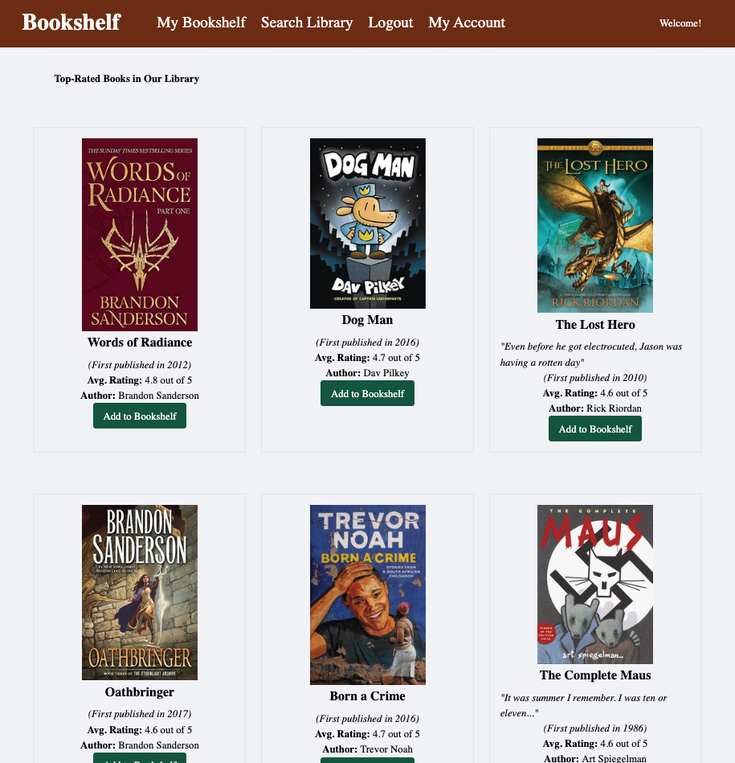
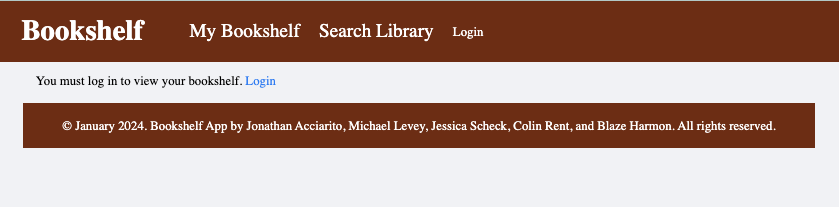
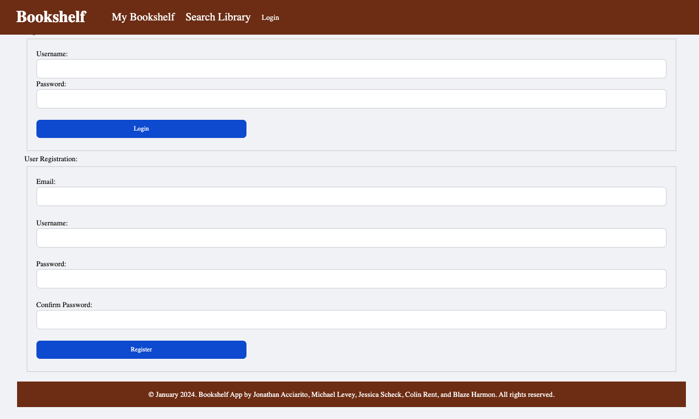
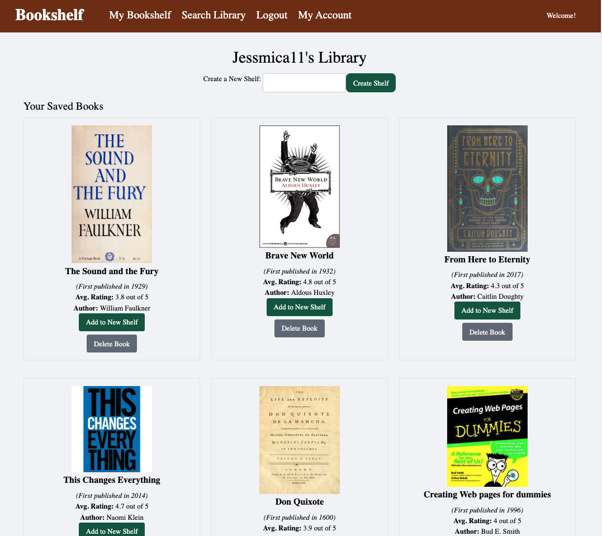
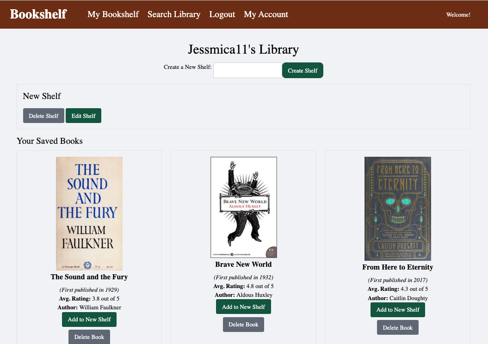
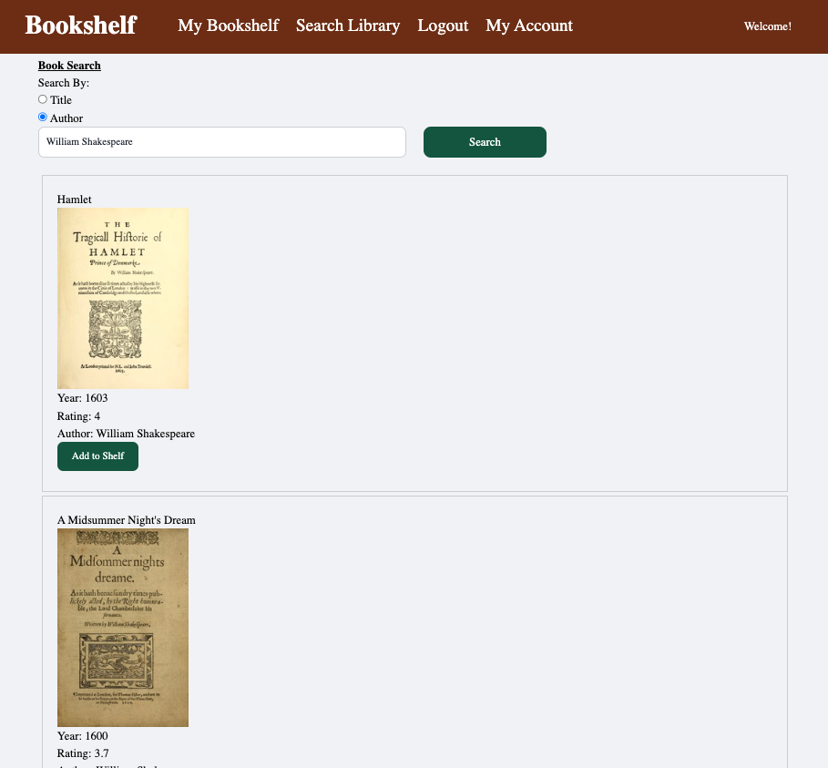
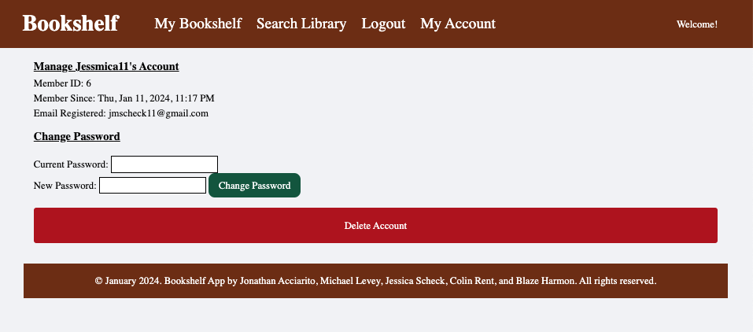
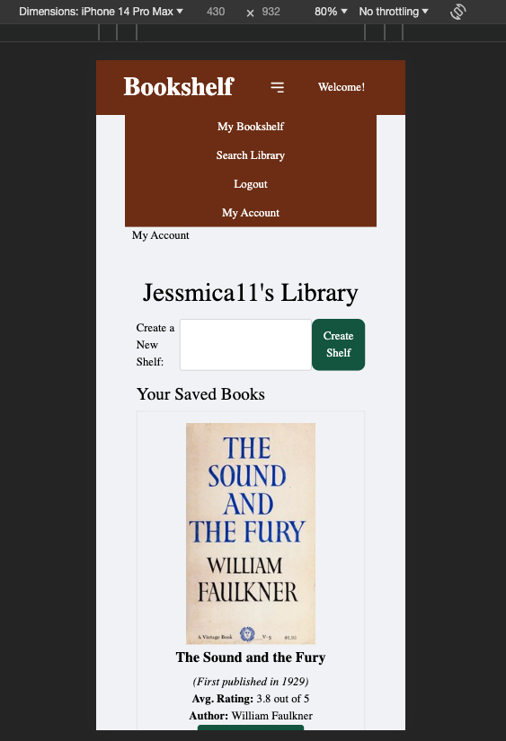

# Bookshelf

## Table of Contents

- [Title](#title)
- [Description](#description)
- [Installation](#installation)
- [Usage](#usage)
- [License](#license)
- [Contributors](#contributors)
- [Screenshots](#screenshots)

## Description

Welcome to Bookshelf– the ultimate platform for book enthusiasts to come together and showcase their literary journeys! Our website offers a seamless and user-friendly experience for individuals passionate about building and managing their book collections.

## Installation

Do it

## Usage

Link to project: https://book-shelf-ec28e1e38c1b.herokuapp.com

## API Documentation

## User Routes

### /api/users

GET request returns all users

POST request creates a new user and logs them in with the request body:

    {
      "username": "example_username",
      "email": "example@email.com",
      "password": "example_password"
    }

### /api/users/login

POST request logs in an existing user in our database with the request body:

    {
      "username": "example_username",
      "password": "example_password"
    }

### /api/users/logout

POST request logs out the currently logged-in viewer

### /api/users/password

PUT request will change the logged-in user's password with the request body:

    {
      "currentPassword": "current_password",
      "newPassword": "new_password"
    }

### /api/users/:id

DELETE request will delete a user's account, but only if it's the logged in user making the request on their account

## Book Routes

### /api/books

GET request returns all books saved in our database

POST request saves a new record of a book with the request body:

    {
      "title": "The Outsiders",
      "cover_edition_key": "OL5536772M",
      "ratings_average": 4.4,
      "first_sentence": "WHEN I STEPPED out into the bright sunlight from the darkness of the movie house, I had only two things on my mind: Paul Newman and a ride home.",
      "first_publish_year": 1967,
      "author_name": "S. E. Hinton",
      "author_key": "OL397826A",
      "user_id": 1,  // Replace with actual user ID
      "shelf_id": 2   // Replace with actual shelf ID
    }

### Please note, the following values CANNOT be null:

title, first_publish_year, author_key, user_id, shelf_id.

### And the following values CAN be null:

cover_edition_key, ratings_average, first_sentence, author_name

### /api/books/:id

DELETE request will delete a book by its given id

## Shelf Routes

### /api/shelves

GET request returns all shelves

POST request creates a new shelf with the request body:

    {
      "name": "My New Shelf",
      "user_id": 1  // Replace with actual user ID
    }

### /api/shelves/:id

DELETE request will delete a shelf by its id

PUT request will update a shelf's name with the request body:

    {
      "name": "Updated Shelf Name"
    }

## License

MIT

## Contributors

- [Jessica (GitHub)](https://github.com/Jessmica11)
- [Michael (Email)](mailto:mlevey92@gmail.com)
- [Jonathan (Email)](mailto:jonathanacciarito@gmail.com)
- [Blaze (GitHub)](https://github.com/Concentratedcreatives)
- [Colin (Email)](mailto:Crent0699@mail.com)

## Screenshots

"/" Homepage, which shows the initial API calls for the book covers and all the book data

"/bookshelf" Which acts as the user dashboard. If you aren't logged in, you will see text encouraging you to do so

The link for logging in will take you to /logim, where you can create an account or login with your existing credentials

Once you have logged in or created an account, the link will take you to the dashboard or "Bookshelf" section. This is where a user's books are saved and kept for each login.

The user also has the option to create, edit, and delete additional shelves to organize their books.

To add a book, you can utilize the application's search function, which allows you to search a 3rd party API [OpenLibrary](https://openlibrary.org/developers/api) by Title or Author. From here, you can add books to your shelf.

Users can also manage their own accounts, and see information about when it was created.

Our app also features mobile-friendly UI design, with a dropdown menu that collapses into a hamburger menu in the main header. The layout also collapses down for better usage.

